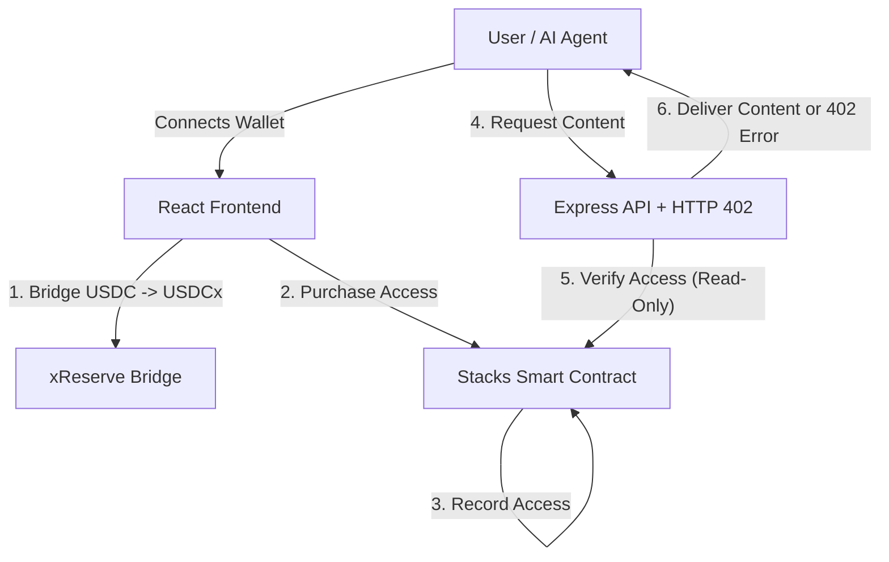

<div align="center">
  <h1>USDCx Content Marketplace</h1>
  
  <h3><strong>The Financial Layer for the AI & Data Economy</strong></h3>

  <p>
    Reviving <strong>HTTP 402</strong> to create a borderless, instant economy for digital content and AI, <br />
    powered by <strong>USDCx</strong> on <strong>Stacks</strong>.
  </p>

  <p>
    <a href="#-features">Key Features</a> •
    <a href="#-quick-start">Quick Start</a> •
    <a href="#-architecture">Architecture</a>
  </p>

  <br />

  
  
  
  
</div>

<br />
<br />

## 🔮 Project Vision

**"To build the native financial layer of the web by reviving the lost HTTP 402 standard. We empower developers to instantly monetize APIs, AI models, and datasets globally using programmable USDCx on Bitcoin layers—creating a frictionless economy for the digital age."**

<br />

---

<br />

## 🎯 The Problem vs. Solution

| The Old Way (Web2) | The New Way (USDCx Marketplace) |
| :--- | :--- |
| ❌ **Complex Subscriptions**: Users hate signing up for monthly plans just to try an API. | ✅ **Pay-Per-Request**: Zero commitment. Pay 0.1 USDCx for exactly what you use. |
| ❌ **High Fees**: Credit cards take 3-5% + 30¢. Micropayments (<$1) are impossible. | ✅ **Micro-Transactions**: Send $0.001 with near-zero gas fees on Stacks. |
| ❌ **Geographic Walls**: "Sorry, this payment method is not available in your country." | ✅ **Global Access**: Anyone with an internet connection and USDCx can participate. |
| ❌ **Chargeback Fraud**: Merchants lose billions to friendly fraud. | ✅ **Finality**: Blockchain transactions are irreversible and secure. |

<br />

## ✨ Key Features

- **🌉 Cross-Chain Bridge**: Seamlessly move USDC from Ethereum Sepolia to Stacks Testnet.
- **⚡ HTTP 402 Protocol**: Standardized status code for "Payment Required" responses.
- **🔐 Token-Gated Access**: access is cryptographically verified on-chain.
- **🤖 AI Ready**: Perfect for monetizing LLM inferences or RAG datasets.
- **💎 USDCx Stablecoin**: No volatility risk for creators—earn in digital dollars.

<br />

## 🏗️ Architecture

The system consists of three main pillars working in harmony:



1.  **Smart Contract**: Handles the logic for pricing, purchases, and access expiration.
2.  **Backend (The Gatekeeper)**: A deeply integrated middleware that intercepts requests. If the user hasn't paid, it responds with `402 Payment Required` and the necessary metadata to complete the transaction.
3.  **Frontend (The Wallet)**: A sleek interface to discover content, bridge funds, and manage access keys.

<br />

## 🚀 Quick Start

### Prerequisites
- **Node.js** v18+
- **Leather Wallet** (Browser Extension)
- **Stacks Testnet** tokens (STX) for gas

### 1. Clone & Install
```bash
git clone https://github.com/Mandip-Kamaliya/content-marketplace.git
cd content-marketplace

# Install dependencies
npm install
cd frontend && npm install
cd ../backend && npm install
```

### 2. Configure Environment
Create `.env` files in both frontend and backend directories.
**(See `.env.example` in respective folders)**

### 3. Run Locally
We use `concurrently` to run both services:
```bash
# from root
npm run dev
```
- Frontend: `http://localhost:5173`
- Backend: `http://localhost:3000`

<br />

## 📝 How to Use

### 1. Bridge Assets
Navigate to the **Bridge** tab. Connect your Ethereum (Sepolia) and Stacks (Testnet) wallets. Enter the amount of USDC to bridge. The xReserve protocol will handle the minting of USDCx on Stacks.

### 2. Buy Content
Browse the marketplace. Click **"Purchase"** on any premium API or dataset. Sign the transaction with your Leather wallet to send USDCx directly to the creator.

### 3. Access Content
Once the transaction confirms (approx. 10-30s), the "Access" button will unlock. Your ownership is verified on-chain, and the backend will serve the protected data.

<br />

## 🧪 Testing

Run the full suite of smart contract tests:
```bash
npm test
```

<br />

## 🏆 Hackathon Submission Details

**Programming USDCx on Stacks - Builder Challenge**
*This project specifically targets the "Best Use of USDCx" category.*

- **Innovation**: We are arguably the first working implementation of HTTP 402 using USDCx on Stacks.
- **User Experience**: We focused heavily on "Pixel Perfect" UI to make Web3 feel like Web2.
- **Completeness**: Includes a working Bridge, Marketplace, and Creator Dashboard.

<br />

## 👨‍💻 Team

**Mandip Kamaliya**
- Role: Full Stack Developer & Blockchain Engineer

<br />

---
<p align="center">
  Built with ❤️ for Stacks
</p>
